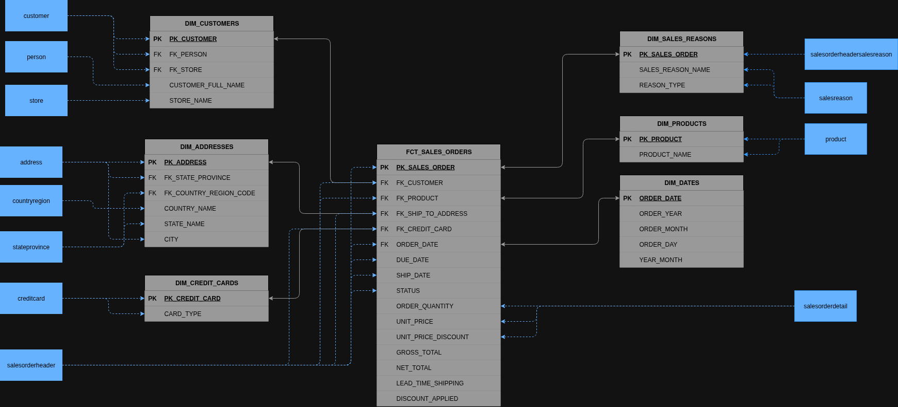

# FEA Desafio

Este repositório contém um projeto dbt utilizado para construir um data warehouse analítico no Snowflake, além de um dashboard Streamlit para visualizar o desempenho de vendas. Os modelos são baseados no conjunto de dados Adventure Works e geram um esquema em estrela com tabelas dimensionais e de fatos. A pasta `sales_dashboard` expõe uma aplicação web que consulta o data warehouse utilizando credenciais do Snowflake fornecidas via variáveis de ambiente.

## Visão Geral/Contexto

A Adventure Works (AW) é uma fabricante de bicicletas em rápido crescimento, com mais de 500 produtos, 20.000 clientes e 31.000 pedidos. Para sustentar esse ritmo e superar a concorrência, a liderança da AW lançou um programa para se tornar orientada por dados, construindo uma plataforma moderna de analytics.

O marco inicial está focado no domínio de Vendas, mas conjuntos de dados do ERP (SAP), CRM (Salesforce), Web Analytics (Google Analytics) e da loja virtual Wordpress em breve serão integrados. A iniciativa é liderada pelo Diretor de Inovação João Muller e conta com o apoio do CEO Carlos Silveira, que exige qualidade de dados impecável — por exemplo, as vendas brutas de 2011 devem reconciliar exatamente para US$ 12.646.112,16, conforme auditado.

A Diretora Comercial Silvana Teixeira questiona o ROI em relação aos gastos promocionais, enquanto o Diretor de TI Nilson Ramos precisa entregar resultados mesmo com uma equipe reduzida de DBAs. Por isso, o projeto prioriza quick wins, testes automatizados de qualidade e uma comunicação clara com as partes interessadas, para demonstrar valor rapidamente e de forma recorrente. Confira abaixo o modelo dimensional construído sobre o conjunto de dados ADW:



## Estrutura do repositório

```
├── models/                # modelos dbt (staging e marts)
├── seeds/                 # arquivos seed carregados no Snowflake
├── resources/             # diagrama de arquitetura do data warehouse
├── sales_dashboard/       # aplicação Streamlit
├── requirements.txt       # dependências do dbt
└── sales_dashboard/requirements.txt # dependências do dashboard
```

## Requisitos

- Python 3.10+
- Conta Snowflake com permissões adequadas
- [dbt-snowflake](https://docs.getdbt.com/reference/warehouse-setups/snowflake-profile) `1.8.3`
- Pacotes adicionais listados em `sales_dashboard/requirements.txt`

## Configuração

1. Clone este repositório e crie um ambiente virtual.
2. Instale as dependências do dbt:

```bash
pip install -r requirements.txt
```

3. Instale as dependências do dashboard:

```bash
pip install -r sales_dashboard/requirements.txt
```

4. Copie o `.env.example` para `.env` e preencha com suas credenciais do Snowflake, ou configure-as diretamente como variáveis de ambiente.
5. Garanta que o perfil em `profiles.yml` corresponda às informações da sua conexão Snowflake.

## Executando o dbt

Com as variáveis de ambiente configuradas, execute o seguinte comando para construir o data warehouse:

```bash
dbt build # testa e constrói todos os modelos
```

Os esquemas gerados serão criados no banco de dados e schema definidos em seu perfil.

## Executando o dashboard

Após construir os modelos, você pode iniciar o dashboard Streamlit:

```bash
streamlit run sales_dashboard/main.py
```

A aplicação consulta o data warehouse Snowflake usando as mesmas credenciais definidas no seu arquivo `.env` ou no `secrets.toml` do Streamlit.

## Licença

Este projeto é disponibilizado para fins educacionais. Consulte o código-fonte para mais detalhes.
